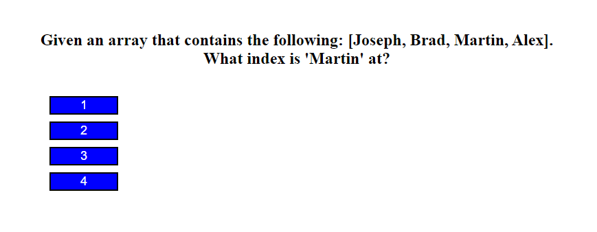
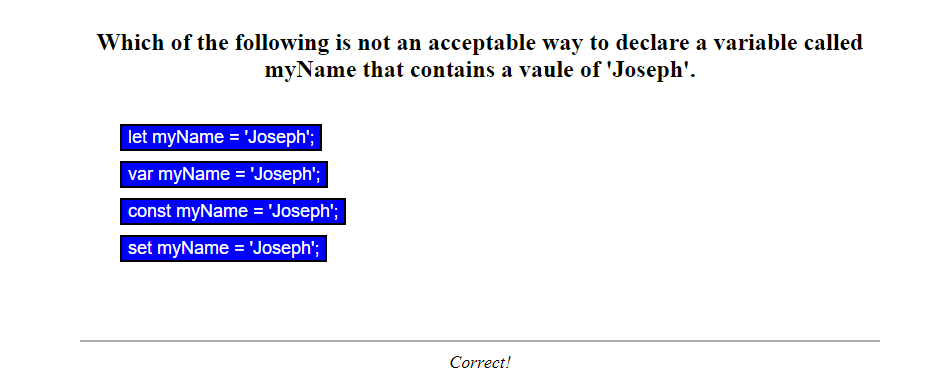
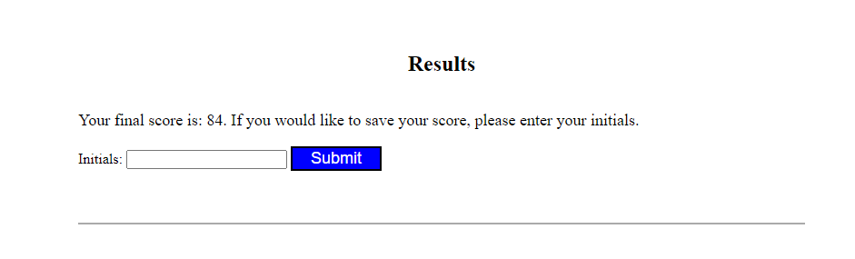
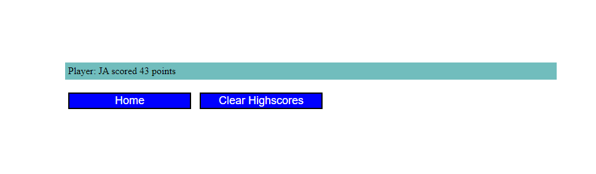

# Javascript-Quiz
## Description
 
 This project was to create a web application that quizes users on some javascript fundamentals. When a wrong answer
 is input, 15 seconds are deducted from the timer. On completion they can store results to a leaderboard.
## Installation

N/A

## Usage

Follow this [link](https://josephfanderson.github.io/Javascript-Quiz) to be taken to the webpage. Once there you can begin the quiz by clicking "Start Quiz". This will cause a question to display on user page. 

Upon selecting an answer a new question will pop up. For a brief moment below the Question / Answer section of the page it will display whether you answered the previous question
correctly or not.

Upon completion of the quiz the user will be take to a screen that displays their final score and allow them to enter their intials to save the attempt to a leaderboard. This data is saved to the users local storage to allow comparison on future attempts.

From the default page, users can also click the View Leaderboard button at the top left in order to view current save highscores. From there they can return home by clicking 'Home' or clear all current scores with 'Clear Highscore'

## License

N/A
